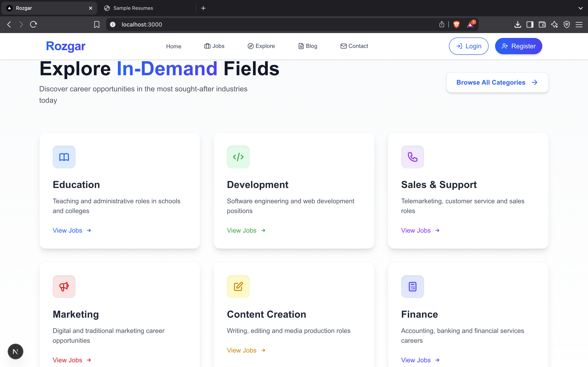

# Rozgar - Job Portal

Rozgar is a comprehensive job portal built with Next.js that connects employers with potential candidates. The platform provides an intuitive interface for job posting, job searching, and career development.

## Screenshots

_Landing page with resume upload and analysis functionality_

_Browse and filter jobs by industry categories_

_Explore curated job recommendations_

_Latest job postings with advanced search and filtering_

_Additional job discovery and navigation options_

## Features

- Modern and responsive UI built with Next.js 14
- Seamless job posting and management for employers
- Advanced job search with multiple filtering options
- Detailed company profiles and candidate portfolios
- Real-time messaging system between employers and candidates
- Fully responsive mobile-friendly design
- AI-powered resume parsing and analysis
- Personalized job recommendations based on skills

## Tech Stack

- Next.js 14 (App Router)
- TypeScript for type safety
- Tailwind CSS for styling
- React for UI components
- FirebaseAuth for authentication
- Firebase Firestore for database

## Getting Started

1. Clone the repository:
